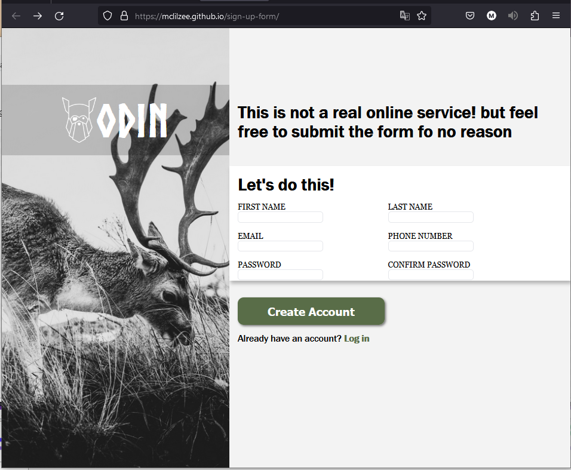

# <a href="https://mclilzee.github.io/sign-up-form">Sign-up Form</a>
A demonstration of front-end sign up forum page, using <a href="https://www.theodinproject.com">The Odin Project</a> as the destination to the sign in so you can get to start learning how to become web developer.

## Disclaimer
The sign-up form is non functional, its simply a front-end design demonstration of how a sign-up form could potentialy look like.

# Example Look

# Credit
### Dear Photo
<a href="https://unsplash.com/@jor9en?utm_source=unsplash&utm_medium=referral&utm_content=creditCopyText">Jorgen Hendriksen</a> on <a href="https://unsplash.com/?utm_source=unsplash&utm_medium=referral&utm_content=creditCopyText">Unsplash</a>

### Odin Logo
<a href="https://www.theodinproject.com">The Odin Project Official Logo</a>
  
